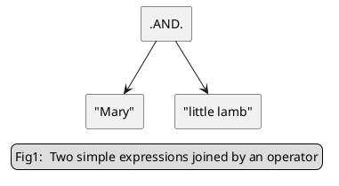
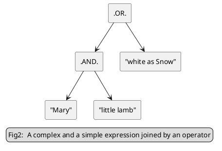
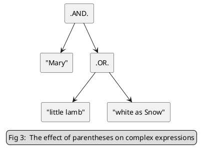
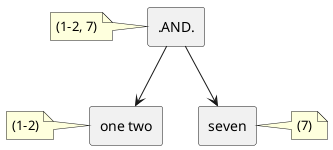
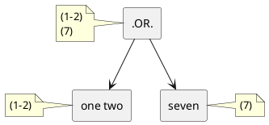

# Lexical Analysis Content Manager Functional Specification

***Version: 2.0***

***Date: 6th April 2020***

***Company Confidential***

[TOC]


-   [Introduction]
    -   [Purpose and scope]
    -   [Definitions, acronyms, and abbreviations]
    -   [References]
    -   [Design constraints]
    -   [Risks and issues]
-   [Standards and conventions]
    -   [Documentation Standards]
    -   [Naming Conventions]
    -   [Programming Standards]
    -   [Development Environment]
    -   [Runtime Environment]
-   [Functionality]
    -   [General capabilities]
    -   [Friendly name]
    -   [Data formats]
    -   [Configuration]
        -   [Expression List Configuration]
        -   [Content Manager Configuration]
    -   [Expressions]
        -   [Configuration][1]
        -   [Simple expression]
        -   [Complex expression]
        -   [Regular expression]
        -   [Pattern expression]
        -   [Macro expression]
    -   [Process]
        -   [Pre-processing:]
        -   [Main processing:]
    -   [Properties]
    -   [Responses]
    -   [THROP information]
-   [Appendix A - .REGEXP. expression syntax]
    -   [Meta-characters]
    -   [Character classes]
    -   [Escape sequences]
    -   [Glossary]
-   [Appendix B - Credit Card Pattern]
    -   [Credit card regular expressions]
    -   [Credit card checksum algorithm]
-   [Appendix C --Lex summary format]
    -   [Top level node]
    -   [Expression Matches]
    -   [Simple Phrases]
    -   [Regular Expressions]
    -   [Complex Expressions]
    -   [FollowedBy Expressions]
-   [Appendix D -- Lex summary format : Policy Server]
    -   [Overview]
    -   [Top level node][2]
    -   [Expression List Node]
    -   [Expression Matches][5]
    -   [Simple Phrases][6]
    -   [Regular Expressions][7]
    -   [Complex Expressions][8]
    -   [FollowedBy Expressions][9]
-   [Appendix E --Behavioural differences between Core technology versions 2.5 and 2.6]
    -   [Logical operators]
    -   [.PERL. within complex expressions]
    -   [Tokenisation]
        -   [Numbers]
        -   [Apostrophes]
    -   [Scoring with "*CountExpressions = true*"]
    -   [Multiple list support]


|**Revision**|   **Author**|     **Date**|      **Comment**|
|------------|-------------|-------------|-----------------|
|0.1         |  Simon Carter  |8-Oct-2002  |Updated from previous version.|
|0.2         |  Simon Carter  |9-Dec-2002  |Updated to include recent code changes.|
|0.3         |  Simon Carter  |23-Jan-2003 |Updated to include recent code changes.|
|0.5         |  Simon Carter  |30-Oct-2003 |Updated to include new functionality|
|0.6         |  Simon Carter  |16-Mar-2004 |Clarified Accumulative and SearchFormatTypeList configuration properties.|
|0.7         |  Simon Carter  |20-Apr-2004 |Added throp stuff.|
|0.8         |  Simon Carter  |22-Apr-2004 |Updated summary appendix|
|0.9         |  Ben Smith     |11-Jan-2007 |Updated to include new pattern functionality|
|0.9.1       |  Ben Smith     |23-Feb-07   |Updated specialised credit card pattern entry. Also updated standard pattern info.|
|0.10.0      |  Alex Sharp    |1-Mar-2007  |Updated to include renaming of User-defined patterns to macros and posixexp expressions to perl expressions.|
|0.10.1      |  Peter Dower   |7-Mar-2007  |Changed NI regular expression to optimised versions. Also corrected the descriptions for '?' and '\\x' in [Meta-characters]{.underline} table.|
|1.0         |  Rob Maidment  |2-Aug-2007  |Added a lot more detail, especially around expression behaviour.|
|1.1         |  Rob Maidment  |6-Aug-2007  |Added explanation of relative token positions, where tokens consist of all punctuation (section 3.5.3.1.1).|
|1.2         |  Rob Maidment  |25-Jan-2008 |Updated to reflect Lex rewrite|
|1.3         |  Peter Dower   |21-May-2008 |Added Appendix C, Lex Summary|
|1.4         |  Mark Wheeler  |14-Nov-08   |Remove CreateSummary and AlwaysAddSummary config options as they have been moved to the base class.|
|1.5         |  Mark Wheeler  |19-Nov-08   |Add new Policy Server summary details|
|1.6         |  Mark Wheeler  |19-Nov-08   |Move Nearness, Threshold and CountExpressions from CM to ExprList|
| 1.7        | Alex Sharp     |6-Apr-20    |Converted the Functional Specification from a CDA Word document to Markdown.|
| 2.0        | Alex Sharp     |30-Apr-20   |Updated to document Lex3, the Lex re-write that occurred during Core Technology 4.0.|


Introduction
============

Purpose and scope
-----------------

This document is intended to give a functional overview of the Lexical Analysis Content Manager. It describes general capabilities (e.g. how the data is searched) and gives detailed information about configuration and the properties and responses that are generated.

Definitions, acronyms, and abbreviations
----------------------------------------

**Context**: - A hierarchical data structure which is used to collect properties and responses during data analysis.

**Content Manager**: - A Content Security component that can detect, and optionally remove, threats in data.

**MIMEsweeper**: - The family name of the range of Content Security products developed by Content Technologies.

**Plugin**: - A special kind of MIMEsweeper 4.0 software component which can be created by reference to a friendly name \[5\].

**Plugin Configurator**: - A software component used to configure a plugin such as a Content Manager or Format Manager.

**Property**: - A name-value pair that used in MIMEsweeper 4.0 to hold a single piece of information.

**Response**: - A standardised data structure describing the action taken by a Format Manager or Content Manager.

**THROP**: - Acronym for THReat and OPportunity.

**Core Technologies Extended ABNF**: - The difference between Core Technologies Extended ABNF and RFC Extended ABNF is the addition of the single quote syntax ("'") in Core Technologies Extended ABNF. In ABNF strings specified in double quotes are define as case-insensitive, and until recently (RFC-7405) they didn't have a simple way to specify case-sensitive strings. So we added single quoted strings and defined them as being case-sensitive strings. 

References
----------

\[1\] Software Coding Standard, C++ version.

\[2\] MIMEsweeper 4.0 development environment.

\[3\] MIMEsweeper 4.0 runtime environment.

\[4\] MIMEsweeper 4.0 development guidelines.

\[5\] MIMEsweeper 4.0 plugin architecture.

\[6\] MIMEsweeper 4.0 Content Manager interface specification.

\[7\] MIMEsweeper 4.0 Plugin Configurator interface specification.

\[8\] LEX Content Manager Summary Schema. \$/Content Security/Source/xml\_schemas/lex.xsd

\[9\] Lex patterns Functional Specification.

\[10\] Content Manager Base Class Configuration Properties

Design constraints
------------------

This Content Manager must be implemented as a MIMEsweeper 4.0 plugin \[5\] which conforms to the MIMEsweeper 4.0 Content Manager interface \[6\].

The associated Plugin Configurator, if required, must conform to the MIMEsweeper 4.0 Plugin Configurator interface \[7\].

Risks and issues
----------------

Many scenarios rely on the Lex Content Manager.

Standards and conventions
=========================

Documentation Standards
-----------------------

No documentation style for MIMEsweeper 4.0 is currently defined.

Naming Conventions
------------------

Source files are to follow the conventions laid down in the Software Coding Standard \[1\].

Programming Standards
---------------------

Source code will be written in C++ and should conform to the Software Coding Standard \[1\].

Development Environment
-----------------------

See the specification of the MIMEsweeper version 4.0 development environment \[2\].

Runtime Environment
-------------------

See the specification of the MIMEsweeper version 4.0 runtime environment \[3\].

Functionality
=============

General capabilities
--------------------

This Content Manager searches Unicode text for one or more of a given list of expressions.

Friendly name
-------------

The friendly name of this Content Manager is "Enhanced Lexical Analysis".

Data formats
------------

Only native Unicode text is processed. Format Managers for document formats (eg. MS Office) create Text Views for both the document body or bodies and any metadata the Format Manager can extract. These Text Views then make the text of the document available in a sequence of Tokens that expose the text in Unicode form. The text exposed by the Tokens is normalised. These tokens are also capable of redacting the text they contain and having the redacted text reincorporated into the original document.

ACS_TODO: ADD document redaction.

ACS_TODO: ADD deciption of summaries

Configuration
-------------

The configuration has been spilt up into two parts.

### Expression List Configuration

#### Location of configuration

The Lex Expression List configuration will be in the *External
References* section of the policy.

There are two types of expression list. 

The first is the *Managed Lexical Analysis Expression List*. This is where the actual expressions are stored in an external file, outside of the main policy. This file is then referenced by a *Managed Lexical Analysis Expression List* object in the *External References* section of the policy. The external file has the same format as the normal unmanaged Expression List.

The second is the normal unmanaged Expression List. In this case the expressions then selves are contain within the Expression List in the *External References* section of the policy.

The two types of list can be distinguished by their friendly names. The normal unmanaged Expression List will have a friendly name of either *Expression List* or *Lexical Analysis Expression List*. While the managed expression lists will use either *Managed Expression
List* or *Managed Lexical Analysis Expression List*.


ACS_HERE End Thur 30/4

#### Expression List Configuration Options


|**Name**                                      |**Type**  |**Default**  |**Purpose**|
|----------------------------------------------|----------|-------------|-----------|
|Expression ("PresetExpression" also accepted) |String    |None         |Three to five values separated by commas constituting an optional comment and optional Ignore Duplicates option, the case-sensitivity, weighting, and definition of each expression to be searched for. Can occur multiple times, must occur at least once. See "Expressions" below.|
|Comment                                       |String    |None         |Optional description of the expression list. Used in the Lex Summary creation (see Lex Summary below).|
|Threshold                                     |Integer   |1            |The threshold total score that must be achieved across all expressions for the content manager to return a Detected response. <p>In the range 1 to 2,147,483,648 (max int32)|
  Nearness                                       |Integer   |10           |Defines the behaviour of the .NEAR. operator: the sub-expressions linked with the .NEAR. operator must occur within these many words[^1] of each other for the operator to return a positive response. In the range 1 to 2,147,483,648 (max int32)|
  |CountExpressions                              |Boolean   |False        |Whether multiple occurrences of the same expression should all count towards to the score.|
  |CountExpressionsItemScope                     |Boolean   |False        |Controls the scope of the *CountExpressions* option. If it's *true,* the *CountExpressions* option is applied at the Item/Node level, an Item at a time. Otherwise it's applied at the Text View level. <p> It doesn't have any effect if *CountExpressions* is *true*.<p> But if *CountExpressions* is *false* and *CountExpressionsItemScope* is *false*, the score is incremented, by the weight of the expression, once for each Text View containing any matches for that expression. If *CountExpressionsItemScope* is *true*, the score is only incremented, by the weight, once for each Item containing any Text Views containing any matches for that expression. <p> This also has a similar effect on the scope of the optional *IgnoreDuplicates* flag in the expressions contained within the list. See the description of the *IgnoreDuplicates* flag in the Expressions section below.|
 | DefaultClean                                 | Boolean   | False        | Indicates that if  the expression list triggers and  the Content Manager is set to redact the Content Manager should attempt to redact all matching text whether it is inside a .CLEAN. operator or not. |
  | Followedby                                  | Integer   | 10           | Defines the behaviour of the .FOLLOWEDBY. operator: text  matching the sub-expressions preceding the .FOLLOWEDBY. operator must be followed by text matching the sub-expression after it within these many words[^1] for the operator to return a positive response.<p>In the range 1 to 2,147,483,648 (max int32)  |

> **[^1]:** Strictly speaking this should say "tokens" not "words". Text is parsed into tokens separated by whitespace where a token is either a word or sequence of punctuation characters.

#### Expression List options that were explicitly removed from previous versions of Lex

Some of the configuration options supported by the older versions of Lex are not mentioned 
here, because they support features that have been dropped, because they are no longer needed. 

The following options have been explicitly removed:

-   TreatPuncAsNormal

### Content Manager Configuration

#### Content Manager Base Class options

All content managers share some common configuration parameters -- these are defined in \[10\].

All normal Content Manager Base Class configuration options are
supported by Lex. However the following two options do have some
limitations.

##### Limitations of the *Direction* base class configuration option 

The only directions supported by Lex are:

-   TopDown
-   PreCompose

Configure any other Direction and an error will be returned at
configuration time.

Also redaction is not supported in *TopDown*. There are no restrictions in *PreCompose*.

##### Limitations of the *ProperyTest* base class configuration option 

Any *PropertyTest* expressions configured on the Lex3 Content Manager
will be evaluated against the document or message node, even when Lex3
is configured to scan only headers or meta data. They will not be
evaluated against just the headers/meta data, as headers and meta data
are no longer separate nodes.

#### Currently supported configuration option 

The following parameters are specific to the Lexical Analysis Content Manager:

| **Name**             | **Type** | **Default**   |**Purpose**                       |
|----------------------|----------|---------------|----------------------------------|
| Comment              | String   | None          | Optional description of the content manager instance. Used in the Lex Summary creation (see Lex Summary below)|
| ExpressionList       | String   | None          | Specifies the name of an existing expression list to be used. Can only appear once for a single instance of Lex. For example:    <p>*\<Property name=\"ExpressionList\" type=\"string\" value=\"Profanity List (English)\"/\>*    <p> means that a key *"Profanity List (English)"* containing a list of expressions exists in the External References section.    <p>If this parameter does not occur the content manager raises an error.|
| ScanMode                | String  | SearchAll | One of the following (case insensitive) strings: <br> * *SearchAll* -- Evaluate all the expressions in the expression list against all the text it is configured to scan. Do not perform redaction irrespective of outcome. <br> * *StopAtThreshold* -- Evaluate the expressions in the expression list against the text it is configured to scan, but stop as soon as the threshold is equalled or exceeded. Do not perform redaction irrespective of outcome. <br> * *Redact* -- (Not supported in *TopDown* Direction). Evaluate all the expressions in the expression list against all the text it is configured to scan. If the threshold is exceeded attempt redaction on any matched text the configuration indicates should be redacted. |
| TextViewsToLex      | String  | Empty     | A comma-separated list of Text View identifiers for the Text Facet Text Views, the Content Manager should run. If the initial character is '!', the logic is reversed from 'run' to 'do not run'. <br><br>Valid Text View identifiers are:<br> * Body <br> * Header <br> * Footer <br> * Footnote <br> * Endnote <br> * Textbox <br> * Annotation <br><br> If this option is empty or missing it means don't scan any Text Facet Text Views. If it just contains '!' it means scan all Text Facet Text Views.|
| MetaDataToLex       | String  | Empty     | A comma-separated list of Meta Data Field names, for the Meta Data Facet Text Views the Content Manager should run. If the initial character is '!', the logic is reversed from 'run' to 'do not run'. <p> If this option is empty or missing it means don't scan any Meta Data Facet Text Views. If it just contains '!' it means scan all Meta Data Facet Text Views. |
| LexScriptFacet      | Boolean | false     | If true any Text View output by any non-remote Script objects returned from the Script facet will also be scanned. |
| MaxTotalListedMatches | Integer | 0       | The maximum number of matches listed in a single Lex summary before the summary is truncated. <p>If there were more matches than this limit, the number of matches from each expression included in the summary, will be proportional to the total number of matches detected.<p> However at least one match from each matched expression per text view will  be listed, even if it takes us over this limit. 0 means unlimited.  |
| MaxMatchLen      | Integer | 0    | The maximum number of characters of  summary text  (excluding tag and attribute names) written into a single match summary before it is truncated.<p>This is rounded up to the end of the nearest *Match* or *Surrounding* tag. <p>0 means unlimited. |
| PreambleSize   | Integer | 60   | The maximum length (in characters) of the preamble of a match, rounded down to the last token. If preamble and postamble overlap they will be merged. |
| PostambleSize     | Integer | 60     | The maximum length (in characters) of the postamble of a match, rounded down to the last token. If preamble and postamble overlap they will be merged. |
| IgnoreMetadataReadWriteFlag  | Boolean | true     | Configuration option for ignoring/overriding the **"xpacket end='w'"** command in an XMP Metadata blocks. This command controls whether the Metadata block should be write protected or not. <p> If this option is *true*, we ignore the value of **xpacket end** and make the XMP Metadata available for modification. Otherwise we respect the value in **xpacket end** and any redaction attempted **may** fails if appropriate.  |

> **Note:** Lex will fail configuration if:
>-   No ExpressionList option is specified.
>-   If ExpressionList does not refer to a valid expression list.
>-   Both of TextViewsToLex and MetaDataToLex are either missing or empty.

#### Options that were explicitly removed from previous versions of Lex

Some of the configuration options supported by the older versions of Lex are not mentioned 
here, because they support features that have been dropped, because they are no longer needed. 

The following options have been explicitly removed:

-   ItemTypesToLex
-   SearchFormatTypeList (us base class FormatTypeList instead)
-   Accumulative
-   AccumulativeScoreName
-   Expression (dropped from the Content Manager configuration)

Expressions
-----------

### Expressions Format

The "expression" configuration parameter in the Expression List consists of three to five values separated by commas, constituting an optional comment, the case-sensitivity, the optional Ignore Duplicates flag, weighting, and definition of each expression to be searched for. 

The Core Technologies Extended ABNF for an expression is as follows:

<code>

    ExpressionValue = ['<' Comment '>,'] CaseSensitivity ',' [IgnoreDuplicates ','] Weighting ',\"' Expression '\”'                              
    
    CaseSensitivity = "True" / "False" / "CaseInSensitive" / "CaseSensitive"
    
    Weighting = "-1" / PositiveInt
    
    IgnoreDuplicates = "True" / "False" 
    
    PositiveInt = ; A base 10 decimal string for a value from 1 to ‭2,147,483,648‬

</code>

>**Note:** See the [Definitions, acronyms, and abbreviations] section for information on Core Technologies Extended ABNF.

For example:

    CaseInsensitive, 1, "Haddock"

#### Optional Comment 

The optional *comment*, if present, must be enclosed in angle brackets. It is returned via the throp details if the threshold is exceeded.

#### Case-Sensitivity

The *case-sensitivity* field must be one of the following four values (not itself case-sensitive):

-   CaseSensitive or True -- to indicate the expression is case-sensitive.
-   CaseInsensitive or False -- to indicate the expression is not case-sensitive.

#### Optional *IgnoreDuplicates* flag 

The optional *IgnoreDuplicates* flag defaults to false. 

If this option is true and multiple expression matches contain the same text, in the same order, when compared under the case sensitivity flag. All of the duplicate matches will only be scored once. They don't have to match the same actual words in the document, they just need to contain the same text in the same order.

##### For example:

If we have the text:

    "Rover the dog, Moggy the cat. Rover the dog, Moggy the cat."

And the expression:

    "(Moggy .AND. cat) .OR. (Rover .AND. dog)"

If the *IgnoreDuplicates* option is not used (omitted or set to false) we get the following 8 matches, all of which will contribute separately to the score:

1.  the dog, ***Moggy*** the ***cat***. Rover the dog, Moggy the cat.
2.  Rover the dog, ***Moggy*** the cat. Rover the dog, Moggy the ***cat***.
3.  Rover the dog, Moggy the ***cat***. Rover the dog, ***Moggy*** the cat.
4.  Rover the dog, Moggy the cat. Rover the dog, ***Moggy*** the ***cat***.
5.  ***Rover*** the ***dog***, Moggy the cat. Rover the dog, Moggy the cat.
6.  ***Rover*** the dog, Moggy the cat. Rover the ***dog***, Moggy the cat.
7.  Rover the ***dog***, Moggy the cat. ***Rover*** the dog, Moggy the cat.
8.  Rover the dog, Moggy the cat. ***Rover*** the ***dog***, Moggy the cat.

(Contributing to the score means the score is incremented by the weight for each match that contributes, as long as the weight isn't -1. A weight of -1 means trigger immediately.) 

But matches 1, 2 and 4 match the text "Moggy", "cat" and matches 5, 6 and 8 match "Rover", "Dog". While match 3 matched ""cat", "Moggy" and match 7 matched "dog", "Rover".

So if *IgnoreDuplicates* is set to true, we still match all 8 matchers and they will be returned in the summary. But because matches 1, 2 and 4 all match the same text in the same order, they will only be scored once. Like wise for matches 5, 6 and 8. But because of the order of the text in matches 3 and 7 they are unique. So both of those matches still contribute separately to the score. So if *IgnoreDuplicates* is set to true, we get all 8 matches, but we only score 4 of them.  

##### Interaction with other options 

The *IgnoreDuplicates* flag has no effect if the expression lists *CountExpressions* option is false. As if *CountExpressions* is false any number of matches, whether duplicate or not, will only contribute to the score once.

The *IgnoreDuplicates* flag also has no effect if the weight of the expression is -1. Because a weight of -1 means trigger immediately and the resultant score of both the expression and the expression list will be -1. Irrespective of how many times the expression matched. 

The expression lists *CountExpressionsItemScope* option also effects the scope of the *IgnoreDuplicates* flag. 

If the *CountExpressionsItemScope* option is false and the *IgnoreDuplicates* flag is true duplicates will be checked at the Text View level. Meaning if we have two matches in different text views containing the same text they will always contribute to the score separately. Had those two matches occurred in the same Text View they would have been considered duplicates and would have only contributed to the score once.

But if both the *CountExpressionsItemScope* option and the *IgnoreDuplicates* flag are true, duplicates will be checked at the Item (Document) level. Meaning if we have two matches in different Text Views, in the same item, containing the same text, they will contribute to the score only once. If they would have been considered duplicates had the matches occurred in the same Text View.

In all these cases the total number of matches will still be reported in the summary and the matches will still be listed. 

#### Weighting

The *weighting* defines the value that will be added to the overall score if the expression matches. When the score reaches the configured threshold the content manager returns detected. A special weighting value of -1 means that the Content Manager will return detected if the expression matches one or more times, no matter what the score or threshold.

ACS_HERE END Fri 1/5

#### Definition

The *definition* field contains the expression to be searched for. There are five types of expression:

-   Simple (literal word or phrase)
-   Complex (an operator combining two other expressions)
-   Regular expression (using .REGEXP. or .PERL. keyword)
-   Pattern
-   Dictionary 
-   Qualifiers

>Note: Complex expressions use an operator to combine two other expressions, which can be of any type. Also it is possible (in theory at least) to define complex expressions in terms of other complex expressions, ad infinitum. Also Qualifiers are an extension to Patterns and cannot be used on there own.

### Simple expression

A simple expression is a literal string (word or phrase). For the purpose of matching, the string is separated into tokens. The tokenisation process works as follows:

The characters in each token are either all numeric[^2], alphanumeric[^3] or all punctuation.  Whitespace cannot occur in a token but does act as a separator between tokens. The white space following a token will also be recorded within the token, as while matching some Patterns this can be significant.  Some Japanese characters have implicit word-breaks - these can also act as token delimiters.  Hence a break between tokens is caused by either a change of type (numeric/alphanumeric/punctuation), whitespace, or a Japanese character with implicit word-break characteristics.

> **[^2]:** Though commas, acting as thousand separators, and full stops, acting as decimal points, may also occur within a numeric token as long as there in the correct position in the number. 

> **[^3]:** Apostrophise may be included in alphanumeric tokens if the indicate the token is an abbreviation.

The following table shows how various example expressions are tokenised.

|**Expression**      |**Tokens (shown in square brackets)**                 |
|--------------------|------------------------------------------------------|
|one two three       |\[one\] \[two\] \[three\]                             |
|one, two three      |\[one\] \[,\] \[two\] \[three\]                       |
|twenty-one          |\[twenty\] \[-\] \[one\]                              |
|c++                 |\[c\] \[++\]                                          |
|c++ & pascal        |\[c\] \[++\] \[&\] \[pascal\]                         |
|1111-2222-3333-4444 |\[1111\] \[-\] \[2222\] \[-\] \[3333\] \[-\] \[4444\] |
|1111 2222 3333 4444 |\[1111\] \[2222\] \[3333\] \[4444\]                   |
|£1,999,95           |\[£\] \[1,999.95\]                                    |
|pigs can't fly      |\[pigs\] \[can't\] \[fly\]                            |

When an expression is searched for in some text, the text is tokenised in the same way.

**An expression matches the text if the following is true:**

***All the tokens from the expression occur in sequence in the text, either consecutively or separated only by punctuation tokens.***


Note that this means the text can contain additional punctuation that is not specified in the expression yet still match the expression. This is a powerful feature; it means expressions can be written without concern for hyphenation, for example. The reverse is not true however: if the expression contains punctuation this must occur in the text. Generally when configuring expressions the administrator should omit punctuation unless he/she is specifically interested in detecting that punctuation.

The following table shows some example expressions, the tokens created from the expressions, some example text and the tokens created from the text, and the match results (assuming case-insensitive expressions):

|**Expression**  |**Expression Tokens**  |**Text**              |**Text Tokens**       |**Result**   |
|----------------|-----------------------|----------------------|----------------------|-------------|
|see saw         | \[see\] \[saw\]       |see saw               |\[see\] \[saw\]       |match        |
|see saw         |\[see\] \[saw\]        |see-saw               |\[see\] \[-\] \[saw\] |match        |
|see saw         |\[see\] \[saw\]        |see - saw             |\[see\] \[-\] \[saw\] |match        |
|see saw         |\[see\] \[saw\]        |I see saw dust        |\[I\] \[see\] \[saw\] \[dust\] |match        |
|see saw         |\[see\] \[saw\]        |I see. Saw that up    |\[I\] \[see\] \[.\] \[Saw\] \[that\] \[up\] |match    |
|see saw         |\[see\] \[saw\]        |I see. - Saw that up  |\[I\] \[see\] \[.\] \[-\] \[Saw\] \[that\] \[up\] |match   |
|see-saw         |\[see\] \[-\] \[saw\]  |see saw               |\[see\] \[saw\]       |no match     |
|see-saw         |\[see\] \[-\] \[saw\]  |see-saw               |\[see\] \[-\] \[saw\] |match        |
|see-saw         |\[see\] \[-\] \[saw\]  |see - saw             |\[see\] \[-\] \[saw\] |match        |
|see-saw         |\[see\] \[-\] \[saw\]  |I see saw dust        |\[I\] \[see\] \[saw\] \[dust\] |no match     |
|see-saw         |\[see\] \[-\] \[saw\]  |I see. Saw that up    |\[I\] \[see\] \[.\] \[Saw\] \[that\] \[up\] |no match     |
|see-saw         |\[see\] \[-\] \[saw\]  |I see. - Saw that up |\[I\] \[see\] \[.\] \[-\] \[Saw\] \[that\] \[up\] |match        |

Note that if the expression see-saw had spaces (see - saw) the results would be identical since the tokens produced for the expression would still be the same.

### Complex expression

A complex expression consists of an operator used to join two further expressions (referred to as *left* and *right* since in the expression they are placed either side of the operator). These further expressions can be of any type, including complex expressions.

For example, the .AND. operator joins two expressions such that *both* sub-expressions must match for the .AND. expression to match:

    Mary .AND. little lamb

This means the two simple expressions "Mary" and "little lamb" must both match.

Similarly, the .OR. operator joins two expressions such that *either* sub-expression must match for the .OR. expression to match:

    little lamb .OR. quite contrary

This means that at least one of the two simple expressions "little lamb" and "quite contrary" must match.



The sub-expressions themselves can also be complex expressions, eg:

    Mary .AND. little lamb .OR. white as snow

Expressions are evaluated left-to-right, so this expression is evaluated as a complex .AND. expression where the sub-expressions are "Mary" and "little lamb", which then becomes the left sub-expression in a complex .OR. expression, where the sub-expressions are the .AND. complex expression and the simple expression "white as snow".



This expression will match if the text contains "Mary" and "little lamb", or if the text contains "white as snow".

Parentheses can be used to change the order in which expressions are evaluated. For example:

    Mary .AND. ( little lamb .OR. white as snow )

This forces the .OR. expression to be evaluated first.



The meaning of the expression has now changed. The expression will match if the text contains "Mary" and either "little lamb" or "white as snow".

The following table describes the available operators:

|**Logical Operator**     |**Meaning**                                                        |
|-------------------------|-------------------------------------------------------------------|
|.AND.                    |Both sub-expressions must be present in the search data.|
|.OR.                     |At least one of the sub-expressions must be present in the search data.|
|.XOR.                    |One of the sub-expressions must be present in the data but not both.|
|.ANDNOT.                 |The left sub-expression must be present and the right sub-expression must *not* be present in the data.|

<p>

|**Unary Operator**   |**Meaning**                                                           |
|-------------------------|----------------------------------------------------------------------|
| .CLEAN.      | This operator does not affect the text matching process.<p> It only has any affect when the expression list has triggered and the instance of the Lex Content Manager is configured to redact. In this case it causes all text matching the sub-expression inside the scope of the .CLEAN. operator that was also matched by the whole expression to be redacted. |

<p>

|**Proximity Operator**   |**Meaning**                                                           |
|-------------------------|----------------------------------------------------------------------|
|.NEAR.                   |Both sub-expressions must be present in the search data and at least one occurrence of the left must be within the configured nearness threshold (number of tokens) of at least one occurrence of the right.|
| .NEAR=x.                | Both sub-expressions must be present in the search data and at least one occurrence of the left must be within the specified nearness threshold (number of tokens) of at least one occurrence of the right. This is specified in the parameter *x* after the equal sign. <p> The value of x will be in the range 1 to 2,147,483,648 (max int32)    |
|.BEFORE.                 |Both sub-expressions must be present in the search data and at least one occurrence of the left must occur before at least one occurrence of the right. (In other words the first occurrence of the left must be before the last occurrence of the right).|
|.AFTER.                  |Both sub-expressions must be present in the search data and at least one occurrence of the left must occur after at least one occurrence of the right. (In other words the last occurrence of the left must be after the first occurrence of the right).|
|.FOLLOWEDBY=*x*.         |Both sub-expressions must be present in the search data and at least one occurrence of the right must occur within x tokens after at least one occurrence of the left.|
| .FOLLOWEDBY. | This behaves the same as the .FOLLOWEDBY=x. operator, except instead of using a specified distance, it uses the expression list wide followed by distance. The expression list wide distance is specified by the Expression List *Followedby* configuration option.  |

#### Proximity operators linking simple sub-expressions

Proximity operators compare the relative location of two sub-expressions. The location of a simple sub-expression is its word offset into the data. Hence every word has a unique location. Where an expression consists of multiple words if effectively has multiple locations, one for each word. All the expression's locations are taken into account if the expression is linked using a proximity operator.

For example, in the test data:

    One two three four five six seven eight nine ten

The location of "four five six" is considered to be 4-6 (locations are 1-based, not 0-based).

 So assuming Nearness is defined as 1, the expression "two three .NEAR. four" does match because one of the locations of "two three" is near "four". Likewise the expression "two three .NEAR. one" also matches because one of the locations of "two three" is near "one". 

The definition of proximity operators when using simple sub-expressions can therefore be refined as follows:

##### Logical operator difference table 1

> **Note:** In the following table by *Meaning* we mean meaning when linking *simple multi-word* sub-expressions.

|**Proximity Operator**   | **Meaning**           |
|-------------------------|-------------------------------------|
|.NEAR.                   |Both sub-expressions must be present in the search data and at least one occurrence of the left must *start or end* within the configured *nearness* threshold of *any part* of at least one occurrence of the right.   |
|.NEAR=x.                 |Both sub-expressions must be present in the search data and at least one occurrence of the left must *start or end* within the specified (in *x*) nearness threshold of *any part* of at least one occurrence of the right.  |
|.BEFORE.                 |Both sub-expressions must be present in the search data and at least one occurrence of the left must *end* before *the start of* at least one occurrence of the right. (In other words the first occurrence of the left must *end* before *the start of* the last occurrence of the right).   |
|.AFTER.                  |Both sub-expressions must be present in the search data and at least one occurrence of the left must *start* after *the end of* at least one occurrence of the right. (In other words the last occurrence of the left must *start* after *the end of* the first occurrence of the right).   |
|.FOLLOWEDBY=*x*.         |Both sub-expressions must be present in the search data and at least one occurrence of the right must *start* within x tokens after *the end of* at least one occurrence of the left.   |
|.FOLLOWEDBY.             | Both sub-expressions must be present in the search data and at least one occurrence of the right must *start* within the number of tokens specified in the configured *followby* threshold after *the end of* at least one occurrence of the left.     |

ACS_TODO : Check the use of occurrence above. Do they means occurrence of token in the match or match occurrence.

The following table shows the results of various proximity operators with simple sub-expressions, assuming the test data above and a Nearness setting of 1 (left and right positions in brackets):

##### Logical operator difference table 2

|**Left sub-expression** |**Operator**    |**Right sub-expression**  |**Result**                |
|------------------------|----------------|--------------------------|--------------------------|
|one two                 |.NEAR.          |three                     |match (1-2,3)             |
|two                     |.NEAR.          |three four                |match (2,3-4)             |
|one two                 |.NEAR.          |four                      |no match (1-2,4)          |
|one                     |.NEAR.          |three four                |no match (1,3-4)          |
|one two three four      |.BEFORE.        |two three                 |no match (1-4,2-3)        |
|one two three four      |.BEFORE.        |four five    (ACS Cherck) |no match (1-4,4-5)        |
|one two three four      |.BEFORE.        |five six                  |match (1-4,5-6)           |
|two                     |.AFTER.         |one two three             |no match (2, 1-3)         |
|three                   |.AFTER.         |one two three  (ACS Cherck)           |no match (3, 1-3)         |
|four                    |.AFTER.         |one two three             |no match (4, 1-3)         |
|one two                 |.FOLLOWEDBY=1.  |three                     |match (1-2, 3)            |
|three                   |.FOLLOWEDBY=1.  |four five                 |match (3, 4-5)            |
|three four five         |.FOLLOWEDBY=1.  |four                      |no match (3-5, 4)         |

ACS_HERE : Mon 4/5

##### Punctuation tokens

Where a token consists of punctuation characters (remember a token is either all alphanumeric or all punctuation), it is assigned the same position as the next alphanumeric token. This is to ensure that proximity operators such as .NEAR. that compare the word distance between two tokens are not affected by punctuation.

For example, the text:

    One, two three

Is tokenised into the tokens and positions specified in the table below:

|**Token**     |One  |,  |two  |three  |
|--------------|-----|---|-----|-------|
|**Position**  |1    |2  |2    |3      |

This ensures that the word-distance between "One" and "two" is still one, even though there is intervening punctuation. Hence proximity operators compare the relative ***word***-distance between two tokens, not *token*-distance; if nearness is defined as one, the token "One" is near to "two" no matter what punctuation exists in between.

Where proximity expressions contain punctuation tokens, the character offset of words is sometimes required to resolve the ambiguity of two tokens having the same position. For example, consider the expression "," .BEFORE. "two" (comma before two) applied to the above text. Both sub-expressions have the same position (two) so the character offset of the comma (3) is compared to the character offset of "two" (5), to determine that "." really is before "two".

Note: This is new behaviour in core tech 2.6. In previous versions the character offset was not used; an equal word position satisfied both BEFORE and AFTER operators. Hence in the above example "," .BEFORE. "two" matched, but so did "two" .BEFORE. ",".

The following table shows the results for various expressions when compared to the following text (assume nearness is defined as 1):

<code>

          One two three - four five six seven eight nine ten
    (Pos:  1   2    3   4  4    5    6    7     8    9    10)
</code>

###### Logical operator difference table 3

|**left sub-expression**  |**operator**   |**right sub-expression**  |**result (pre core tech 2.6)**  |**result (core tech 2.6)**  |
|-------------------------|---------------|--------------------------|--------------------------------|----------------------------|
|three                    |.NEAR.         |four                      |match (3,4)                     |match (3,4)  |
|\-                       |.BEFORE.       |four                      |match (4,4)                     |match (4,4)  |
|four                     |.BEFORE.       |\-                        |match (4,4)                     |**no match** (4,4)  |
|\-                       |.AFTER.        |four                      |match (4,4)                     |**no match** (4,4)  |
|four                     |.AFTER.        |\-                        |match (4,4)                     |match (4,4)  |
|three                    |.FOLLOWEDBY=1. |four                      |match (3,4)                     |match (3,4)  |
|\-                       |.FOLLOWEDBY=1. |four                      |match (4,4)                     |match (4,4)  |
|four                     |.FOLLOWEDBY=1. |\-                        |match (4,4)                     |**no match** (4,4)  |
|\-                       |.FOLLOWEDBY=1. |five                      |match (4,5)                     |match (4,5)  |
|five                     |.FOLLOWEDBY=1. |\-                        |no match (5,4)                  |no match (5,4)  |

If the **TreatPuncAsNormal** option is true none of this applies. Instead all tokens have unique positions. Hence the text:

<code>

    One, two three

</code>

Is tokenised as:

|              |      |     |       |
|--------------|------|-----|-------|
|**Token**     |One,  |two  |three  |
|**Position**  |1     |2    |3      |
|              |      |     |       |

And the text:

<code>

    One , two three             (with a space before the comma)

</code>

Is tokenised as:

|              |      |     |       |       |
|--------------|------|-----|-------|-------|
|**Token**     |One   |,    |two    |three  |
|**Position**  |1     |2    |3      |4      |
|              |      |     |       |       |

#### Proximity operators linking complex sub-expressions

Remember that proximity operators compare the relative location of two sub-expressions. A single occurrence of a complex sub-expression can have *multiple* locations, comprised from the locations of the matching sub-expressions of the complex expression.

Prior to 2.6 the complex expression simply assumed all the locations of its matching sub-expressions. Hence with the test data:

    One two three four five six seven eight nine ten

The complex expression "three .AND. five" had a single occurrence with the two locations: 3 and 5. The occurrence of the expression "seven .OR. eleven" had only one location: 7. The expression "seven .AND. eleven" had no locations since the expression does not match (no occurrences).

This led to some unexpected results when complex expressions were themselves combined using a proximity operator. For example, the .NEAR. operator would match if any of the locations for the left sub-expression are near to any of the locations for the right sub-expression. Hence the expression "(one .AND. seven) .BEFORE. two" would match. On might have expected that both "one" and "seven" had to occur before "two" for a match, but the sub-expression "one .AND. seven" had the locations 1 and 7, and "two" had the location 2. One of the locations for the left expression (1) was before the location of the right expression (2) therefore the expression matched.

The way the list of locations for each occurrence of a complex expression is calculated has changed in core tech 2.6. The meaning of the proximity operators when used to link complex sub-expressions has also changed. Prior to 2.6 a proximity operator required *any* location from an occurrence of the left expression to "match" *any* location from an occurrence of the right expression. In 2.6 *all* locations from an occurrence of the left expression must "match" *all* locations from an occurrence of the right expression.

##### Logical operator difference table 4

|**Proximity Operator**  |**Meaning (when comparing occurrences of *complex* sub-expressions) pre-core tech 2.6**  |**Meaning (when comparing occurrences of *complex* sub-expressions) core tech 2.6** |
|------------------------|-----------------------------------------------------------------------------------------|------------------------------------------------------------------------|
|.NEAR.                  |At least one location of the left occurrence must be within the configured nearness threshold of at least one location of the right occurrence.  |All locations of the left occurrence must be within the configured nearness threshold of all locations of the right occurrence.  |
|.BEFORE.                |At least one location of the left occurrence must be before at least one location of the right occurrence.  |All locations of the left occurrence must be before at all locations of the right occurrence.  |
|.AFTER.                 |At least one location of the left occurrence must be after at least one location of the right occurrence.  |All locations of the left occurrence must be after all locations of the right occurrence.  |
|.FOLLOWEDBY=*x*.        |At least one location of the right occurrence must be after and within x words of at least one location of the left occurrence.  |All locations of the right occurrence must be after and within x words of all locations of the left occurrence.  |

The method for calculating the locations of complex expressions is now as follows:

A single occurrence of a complex expression can have one or more locations. A location can be a position or range of positions. Of course, an expression may have more than one occurrence. The occurrences of a complex expression are calculated using either the *product* or *sum* of the occurrences of the sub-expressions, depending on the type of complex expression.

For example, consider the test data:

    One two three four five six seven eight nine ten

And the expression "one two .AND. seven". The left-hand sub-expression has a single occurrence with the location 1-2. The right-hand expression has a single occurrence with the location 7. The .AND. operator uses the *product* of the sub-expressions which yields a single occurrence with two locations: 1-2 and 7.



Compare with the expression "one two .OR. seven". Again, the left-hand sub-expression has a single occurrence with the location 1-2 and the right-hand expression has a single occurrence with the location 7. The .OR. operator uses the *sum* of the sub-expressions which yields two occurrences, one with the location 1-2 and the other with the location 7.



The difference between product and sum becomes important when complex expressions are linked using proximity operators. Consider the expression "(one two .AND. seven ) .BEFORE. five". Remember the rule for complex expression matching now is that *all* locations of at least one occurrence of the left-hand expression must "match" *all* locations of at least one occurrence of the right-hand side. In the case of .BEFORE. this means that all locations of at least one occurrence of the left-hand expression must be before all locations of at least one occurrence of the right-hand side. In this example the left-hand expression ("one two .AND. seven") has a single occurrence with the locations 1-2 and 7. Whilst 1-2 is before the location of the right-hand expression (5), 7 is not so this expression does not match. Logically this seems correct, you would expect that both "one two" and "seven" need to be before "five" for this expression to match. This is new behaviour: as already mentioned this expression would have matched pre core tech 2.6.

Now consider the expression "(one two .OR. seven ) .BEFORE. five". In this example the left-hand expression ("one two .OR. seven") has two occurrences with the locations 1-2 and 7 respectively . For the whole expression to match, all locations from at least one occurrence must be before 5. Clearly then, the whole expression will match because all the locations from the first occurrence (1-2) are before 5.

Hence "(one two .AND. seven ) .BEFORE. five" *does not* match, whereas "(one two .OR. seven ) .BEFORE. five" *does* match.

The following table summarises the rules used by each operator to derive the locations of complex expressions:

|**Expression**  |**returns true if**                                           |**location**                                                          |
|----------------|--------------------------------------------------------------|----------------------------------------------------------------------|
|.AND.           |both sub-expressions return true                              |product of the sub-expressions' location information                  |
|.OR.            |either or both sub-expressions return true                    |sum of the matching sub-expressions' location information             |
|.XOR.           |either sub-expression returns true but not both               |the matching sub-expression's location information                    |
|.ANDNOT.        |left sub-expression returns true and right sub-expression returns false  |the left sub-expression's location information             |
|.NEAR.          |there is an occurrence from the LHS and an occurrence from the RHS where all locations of the LHS occurrence are near to all locations of the RHS occurrence  |product of the sub-expressions' location information, but only those where the LHS is near to the RHS  |
|.BEFORE.        |there is an occurrence from the LHS and an occurrence from the RHS where all locations of the LHS occurrence end before the start of all locations of the RHS occurrence  |product of the sub-expressions' location information, but only those where the LHS is before the RHS  |
|.AFTER.         |there is an occurrence from the LHS and an occurrence from the RHS where all locations of the LHS occurrence start after the end of all locations of the RHS occurrence       |product of the sub-expressions' location information, but only those where the LHS is after the RHS  |
|.FOLLOWEDBY=n.  |there is an occurrence from the LHS and an occurrence from the RHS where all locations of the RHS occurrence start after and within n words of the end of all locations of the LHS occurrence  |product of the sub-expressions' location information, but only those where the LHS followed by the RHS within n words.  |

The following table shows the results of various proximity operators with complex sub-expressions, assuming the test data above and a Nearness setting of 1:

##### Logical operator difference table 5

|**expression**                         |**left position**  |**right position**  |**result (pre-core tech 2.6)**  |**result (core tech 2.6)**  |
|---------------------------------------|-------------------|--------------------|--------------------------------|----------------------------|
|(one .AND. seven) .NEAR. two           |1, 7               |2                   |match                           |**no match**                |
|(one .AND. seven) .BEFORE. two         |1, 7               |2                   |match                           |**no match**                |
|(one .AND. seven) .AFTER. two          |1, 7               |2                   |match                           |**no match**                |
|three .FOLLOWEDBY=1. (one .AND. four)  |3                  |1, 4                |match                           |**no match**                |
|(one .BEFORE. seven) .BEFORE. two      |1, 7               |2                   |match                           |**no match**                |
|(one .BEFORE. seven) .AFTER. two       |1, 7               |2                   |match                           |**no match**                |

### Regular expression

There are two ways of specifying a regular expression: using the .REGEXP. keyword or using the .PERL. keyword. In each case the keyword is followed by a regular expression to apply to the data, but they have subtly different meanings.

These differences are summarised by the following table and then explained in more detail below.

|**Difference**                       |**.REGEXP.**                                                |**.PERL.**                                      |
|-------------------------------------|------------------------------------------------------------|------------------------------------------------|
|whitespace in expression             |matches any number of whitespace or punctuation characters  |no special meaning (matches single whitespace)  |
|"." in expression                    |no special meaning (matches ".")                            |matches any character                           |
|"?"In expression                     |matches any non-whitespace character                        |repeat modifier (see example below)             |
|orientation                          |word-based                                                  |character-based                                 |
|scope                                |25 tokens at a time                                         |entire data                                     |
|can be used in complex expressions?  |yes                                                         |yes                                             |

Note that new in core tech 2.6 is the ability to use .PERL. regular expressions within complex expressions.

#### .PERL. regular expressions

The .PERL. keyword is the simpler to understand: The expression following the keyword is applied to the test data using Perl-compatible regular expression syntax (a superset of the more familiar Posix syntax). If the expression matches the match restarts from immediately after the match to see if there is another match, and this repeats until there are no more matches. The number of matches is used to calculate the addition to the overall score, in the event that the CountExpressions configuration parameter is True.

"Greedy matching" is used by default, which means the longest possible match is returned each time. For example, consider the following test data:

<p style="text-indent: 40px"><b>She</b> sells <b>sea</b>shells on the <b>sea</b> shore

The case-sensitive regular expression "She.\*sea" matches the phrase "She sells sea" but it also matches the phrase "She sells sea shells on the sea". Hungry matching means that as much of the original text is consumed as possible, so in this case the second phrase would be used, and the search would resume at the space character immediately before the word "shore".

The repeat modifier can be used to make the expression "non-greedy", for example the case-sensitive expression "She.\*?sea" would match "She sells sea" because the repeat modifer ('?') has been used.

Spaces have no special meaning in .PERL. regular expressions.

The Perl regular expression syntax is defined here:

<http://www.boost.org/doc/libs/1_33_1/libs/regex/doc/syntax_perl.html> (version 1.33.1, revision date 21st Aug 2004)

#### .REGEXP. regular expressions

This type of regular expression is non-standard in that it is *token-orientated*. It treats whitespace as a token boundary and performs matching at a token level. For example, consider the test data:

    One two three four five six seven eight nine ten

And the expression:

    .REGEXP. three?*five

One might think the expression would match here because the strings "three" precedes the string "five" in the test data, however the .REGEXP. expression does *not* match in this case because of the special meaning of the '?' character.

Another unusual feature of .REGEXP. expressions is that they do not run over the entire data on one go like .PERL. expressions, instead they operate on a sliding window of 25 consecutive tokens. An obvious implication of this is that a .REGEXP. expression cannot match a string that is more than 25 tokens long.

**The '?' character means "any non-whitespace character".** (Under the hood the '?' is converted to \[\^\[:space:\]\] which means "not whitespace" in regular expression syntax.) In the above example, the "?\*" attempts to match non-whitespace immediately after the "three" token, but there isn't any, there is only whitespace.

If the expression is rewritten with spaces either side of the "?\*" then it *does* match:

    .REGEXP. three ?* five

Similarly, this expression will *not* match:

    .REGEXP. three ?* six

Whereas this expression *will* match:

    .REGEXP. three ?* ?* six

|**Expression**              |**Data**                                          |**Result**  |
|----------------------------|--------------------------------------------------|------------|
|.REGEXP. three?\*five       |one two three four five six seven eight nine ten  |no match    |
|.REGEXP. three ?\* five     |one two three four five six seven eight nine ten  |match       |
|.REGEXP. three ?\* six      |one two three four five six seven eight nine ten  |no match    |
|.REGEXP. three ?\* ?\* six  |one two three four five six seven eight nine ten  |match       |

The other non-standard word-cognisant aspect of the .REGEXP. expression is that any spaces included in the expression are converted to mean "any whitespace or punctuation". (Under the hood spaces are converted to:

    [[:space:][:punct:]]+

meaning one or more whitespace or punctuation).

This is a powerful feature, it means expressions can be written without concern for any punctuation that may occur in the data. For example, the expression ".REGEXP. colou{0,1}r coded" will match against "colour coded" and "colour-coded".

|**Expression**              |**Data**         |**Result**  |
|----------------------------|-----------------|------------|
|.REGEXP. colou{0,1}r coded  |colour coded     |match       |
|.REGEXP. colou{0,1}r coded  |colour-coded     |match       |
|.REGEXP. colou{0,1}r coded  |color coded      |match       |
|.REGEXP. colou{0,1}r coded  |color-coded      |match       |
|.REGEXP. colou{0,1}r coded  |color - coded    |match       |
|.REGEXP. colou{0,1}r coded  |color ... coded  |match       |
|.REGEXP. colou{0,1}r coded  |color. Coded     |match       |

A .REGEXP. expression can be used as a sub-expression in a complex expression.

The syntax for .REGEXP. is defined in Appendix A.

### Pattern expression

The pattern expression takes the form:

<p style="text-indent: 40px">.PATTERN=<I>name</I>.

Where *name* is the name of a pre-defined pattern to recognise. Currently only one pattern name is supported: "CCNUMBER", a pattern designed to detect credit card numbers. See Appendix B for details of the CCNUMBER pattern.

A pattern expression can be used as a sub-expression in a complex expression.


ACS_TODO: Add dictionary here.

ACS_TODO: Add qualifiers here.


### Macro expression

The purpose of this expression type is to enable re-use of complex expressions, typically regular expressions.

The macro expression takes the form:

<p style="text-indent: 40px">.MACRO=<I>name</I>.

Where *name* is the name of an expression that is defined elsewhere in the configuration. The expression definition is simply inserted into the Lex expression in place of the .MACRO. expression. For example, the SMTP Appliance configuration includes two macro definitions: NINUMBER and SSNUMBER which are regular expressions designed to detect UK National Insurance numbers and US Social Security numbers respectively:


```xml
<Key default="Lexical Analysis Pattern List" name="Clearswift Standard Patterns">
  <PropertyList duplicates="true">
    <Property name="Macro" type="string" value="NINUMBER,.PERL.[A-Z]{2}([ -]?)\\d{2}\\1\\d{2}\\1\\d{2}((\\1([A-D]|(?(?<=-) | ?))(\\b|(?=\\W)))|\\b)" /> 
    <Property name="Macro" type="string" value="SSNUMBER,.PERL.\\b(00[1-9]|0[1-9]0|0[1-9][1-9]|[1-6]\\d{2}|7[0-6]\\d|77[0-2])(\\s|-)([1-9]0|0[1-9]|[1-9][1-9])\\2(\\d{3}[1-9]|[1-9]\\d{3}|\\d[1-9]\\d{2}|\\d{2}[1-9]\\d)\\b" />
  </PropertyList>
</Key>
```

The NI number pattern, for example, can be used by including the following expression in a Lexical Analysis expression list:

    .MACRO=NINUMBER.

Process
-------

### Pre-processing:

Although the implementation of SearchArea implies a mail environment, it could be set to 'All' in a web environment.

Returns true when ItemCharset == Unicode and the SearchArea is satisfied.

### Main processing:

Get the next word from the data buffer using rules defined internally and punctuation and whitespace specified by the Unicode standard.

Attempt to find the word at the first level of the expression tree.

If the word was found and it has children retrieve words until the bottom of the tree is reached or the current word did not match.

If the bottom of the tree was reached before a word failed to match then add the associated expressions to the match list.

If running in non-comprehensive scan mode, recalculate the score and stop if threshold exceeded.

Continue until the end of the data.

Once complete; if running in Comprehensive Scan mode, loop through the found expression list evaluating each expression.

If configured to do so and the threshold was exceeded, create the summary and add it to the context.

If the threshold was exceeded add the detected response.

Properties
----------

Set by Content Manager if configured to do so and when the threshold is reached:

|**Name**                                         |**Value(s)**                                                       |
|-------------------------------------------------|-------------------------------------------------------------------|
| "TextScore: " + Content Manager instance name.  |The accumulative score from this instance of the Content Manager.  |


Responses
---------

Set by Content Manager when the configured threshold is reached.

|**Name**                         |**Value(s)**              |
|---------------------------------|--------------------------|
|CCL\_ACTION\_CONTENT\_DETECTED   |CCL\_TYPE\_CONTENT        |

The Lex Summary is now added as part of the response detail. See Appendix C for summary format.

THROP information
-----------------

The following THROP messages may be generated within responses:

|**Message name**                        |**Message code**  |
|----------------------------------------|------------------|
|THROPMSG\_LEX\_DETECTED                 |0x42020F10        |
|THROPMSG\_LEX\_SCANNED                  |0x42020F11        |
|THROPMSG\_LEX\_WORD\_TOO\_LONG          |0xC2020F12        |
|THROPMSG\_LEX\_DETECTED\_WITH\_COMMENT  |0x42020F13        |

-   THROP type defaults to "Text Analysis", but may be overridden by a ThropType configuration property (see \[10\])/

-   THROP detail defaults to the name of the Shared Expression List or the instance name if running in own list mode. This is overridden by any comments specified in the expression configuration, or by a ThropDetail configuration property.

Appendix A - .REGEXP. expression syntax
=======================================

Meta-characters
---------------

|**Meta-character / syntax**  | **Description**                                                                                                         |
|-----------------------------|-------------------------------------------------------------------------------------------------------------------------|
|?                            |Any single ***non-whitespace*** character. The question mark is transparently converted to '\[\^\[:space:\]\]' before being handed to the regular expression engine. This enforces the 'word matching' approach.  |
|\*                           |Zero or more occurrences of the preceding atom.  |
|\+                           |One or more occurrences of the preceding atom.   |
|{x}                          |Matches exactly 'x' occurrences of the preceding atom.  |
|{x,y}                        |Matches between 'x' and 'y' (inclusive) occurrences of the preceding atom.  |
|{x,}                         |Matches 'x' or more (inclusive) occurrences of the preceding atom.  |
|{,y}                         |Matches between 0 and 'y' (inclusive) occurrences of the preceding atom.  |
|\\                           |An escape character that indicates the next character is a literal and not a metacharacter. E.g. '\\\$' matches '\$'. '\\\\' matches '\\'. Escaping a character that is not a metacharacter or a stated **[Escape sequences]** should be avoided. This behaviour is undefined and may produce unexpected results.  |
|(abc)                        |Sub-expression. Matches the characters 'abc' in that order. The entire sub-expression may be subjected to the repeating metacharacters. E.g. '(abc)+' matches 'abc' and 'abcabcabc'  |
|(a\|b\|c)                    |Matches one character, either 'a' or 'b' or 'c'.  |
|\[abc\]                      |Character set. Matches any one character from the list. The whole character set may be subjected to the repeating metacharacters. E.g. '\[abc\]\*' matches 'aabcac' but not 'abcdcba'. Due to the word approach employed by Lex, character sets cannot contain whitespace.  |
|\[\^abc\]                    |Negated character set. Matches any one character which is not in the character set.  |
|\[a-c\]                      |Matches one character in the range 'a' to 'c' (either 'a' or 'b' or 'c'). The range endpoints must be in the correct order. i.e. the first endpoint must precede the second endpoint in the Unicode codepoint sequence. To include a literal '-' character in a character set enter it as the first or last character. |

Character classes
-----------------

Character classes are predefined sets of characters. Character classes may only be used within a character set. E.g. "\[\[:alnum:\]\]" or "\[\[:alnum:\].,\]".

|**Class**     |**Meaning**                                                                                                                                  |
|--------------|---------------------------------------------------------------------------------------------------------------------------------------------|
|\[:alnum:\]   |All alphanumeric characters. Note: This includes the alphabetic characters from language sets other than Latin. E.g. Japanese, Arabic etc..  |
|\[:alpha:\]   |All alphabetic characters. Note: This includes the alphabetic characters from language sets other than Latin. E.g. Japanese, Arabic etc..    |
|\[:blank:\]   |All whitespace characters apart from line separator characters. This character class effectively subverts the word approach used by Lex. Use of this character class is not recommended as it may result in unexpected behaviour.  |
|\[:cntrl:\]   |All control characters.        |
|\[:digit:\]   |All decimal digit characters.  |
|\[:lower:\]   |All lower case characters.     |
|\[:print:\]   |All printable characters.      |
|\[:punct:\]   |All punctuation characters.    |
|\[:space:\]   |All whitespace characters. This character class effectively subverts the word approach used by Lex. Use of this character class is not recommended as it may result in unexpected behaviour.  |
|\[:xdigit:\]  |All hexadecimal digit characters.  |


Escape sequences
----------------

The escape sequences outlined here are case sensitive

**Note**: All other escape sequences (other than escaped metacharacters) are undefined and may not result in expected behaviour. ***They should not be used.***

|**Escape sequence**  |**Meaning**                                                                                                            |
|---------------------|-----------------------------------------------------------------------------------------------------------------------|
|\\x*hhhh*            |A hexadecimal escape sequence -- the character whose code point is 0xhhhh.                                             |
|\\x*hh*              |A hexadecimal escape sequence -- the character whose code point is 0xhh. (This variant requires Boost hence is not supported on MIMEsweeper for SMTP 5.2)  |
|\\x{*hhhh*}          |A hexadecimal escape sequence -- the character whose code point is 0xhhhh. (This variant requires Boost hence is not supported on MIMEsweeper for SMTP 5.2)  |

Glossary
--------

|**Terminology**  |**Definition**                                                                                                                                                |
|-----------------|--------------------------------------------------------------------------------------------------------------------------------------------------------------|
|Atom             |A single character or an expression surrounded by '()', or '\[\]'. These can be wholly affected by repeating metacharacters such as '\*' and by bounds '{}'.  |
|Expression       |A simple keyword, an ordered list of words within a phrase or a regular expression.  |
|Normal           |Alphanumeric characters.  |
|Punctuation      |Any characters other than those classified as normal or whitespace. This class includes the hyphen and underscore characters.                                 |
|Whitespace       |Space, tab, linefeed or carriage return characters. Note: Lex mimics the consolidation of all whitespace characters (or strings of consecutive whitespace characters) to a single space character. This is done by manipulating the expression, not the text. Specifically spaces are changed to "\[\[:space:\]\[:punct:\]\]+" allowing any number of whitespace or punctuation characters between words (as Lex defines them) to be ignored. Expressions using encoded characters or character classes are not manipulated in this way and so can be used to perform 'more normal' regular expression matching. Subverting the Lex word matching approach in this manner is not generally recommended and is rarely, if ever, necessary. If this approach is to be used, note that Lex matches against twenty five token sections of the string at a time so a single REGEXP expression or sub-expression cannot match across more than twenty five tokens.  |
|Word             |A string of alphanumeric characters delimited by whitespace *or punctuation* (or the beginning or end of the string). This leads to words containing punctuation being split into multiple 'Lex words'.  |

Appendix B - Credit Card Pattern
================================

The credit card pattern will search through text looking for valid credit card numbers. Credit cards can vary in length. Credit cards can have 13, 14, 15, 16, 18, or 19 digits.

The digits can be grouped as follows:

<code>

    13 Digit cards: 1111 222 333 444          (e.g. VISA13)
                    1111-222-333-444
                    1111222333444

</code>

<code>

    14 Digit cards: 1111 222222 3333          (e.g. Diners Club International)
                    1111-222222-3333
                    11112222223333

</code>

<code>

    15 Digit cards: 1111 222222 33333         (e.g. American Express)
                    1111-222222-33333
                    111122222233333

</code>

<code>

    16 Digit cards: 1111 2222 3333 4444       (e.g. VISA16, Mastercard)
                    1111-2222-3333-4444
                    11112222333344444

</code>

<code>

    18 Digit cards: 111111 222222222222       (e.g. Solo/switch debit card)
                    111111-222222222222
                    111111222222222222

</code>

<code>

    19 Digit cards: 11111111 22222222 333     (e.g. Solo/switch debit card)
                    11111111-22222222-333
                    1111111122222222333

</code>

Note that the delimiters between the number groups in a credit card must be consistent. Hence for example, this credit card would be valid (assuming it passes the Luhn checksum check):

    11111111 22222222 333

but this would not:

    11111111-22222222 333

Credit card regular expressions
-------------------------------

The regular expressions used to detect these credit card patterns are as follows:

|**Number of digits**  |**Regular expression**                                                  |
|----------------------|------------------------------------------------------------------------|
|13                    |\\b4\\d{3}(( \|-)?)\\d{3}\\2\\d{3}\\2\\d{3}\\b                          |
|14                    |\\b((36\\d{2})\|(30\[0-5\]\\d{1}))(( \|-)?)\\d{6}\\4\\d{4}\\b           |
|15                    |\\b(3\[47\]\\d{2}\|1800\|2131)(( \|-)?)\\d{6}\\2\\d{5}\\b               |
|16                    |\\b(\[346\]\\d{3}\|5\[1-5\]\\d{2})(( \|-)?)\\d{4}\\2\\d{4}\\2\\d{4}\\b  |
|18                    |\\b\[456\]\\d{5}(( \|-)?)\\d{12}\\b                                     |
|19                    |\\b\[456\]\\d{7}(( \|-)?)\\d{8}\\1\\d{3}\\b                             |

These regular expressions will detect the following types of credit card:


| **Card Type**             | **Prefix(es)**                                     | **Length** |
|---------------------------|----------------------------------------------------|------------|
| Visa                      | 4                                                  | 13, 16     |
| Diners Club Carte Blanche | 300-305                                            | 14         |
| Diners Club international | 36                                                 | 14         |
| American Express          | 34, 37                                             | 15         |
| JCB                       | 1800, 2131                                         | 15         |
| Visa Electron             | 417500, 4917, 4913                                 | 16         |
| China Union Pay           | 622 (622126-622925)                                | 16         |
| Diners Club<p>US & Canada | 55                                                 | 16         |
| Discover Card             | 6011, 65                                           | 16         |
| JCB                       | 35                                                 | 16         |
| Maestro (Debit card)      | 5020, 5038, 6759                                   | 16         |
| MasterCard                | 51-55                                              | 16         |
| Solo (Debit card)         | 6334, 6767                                         | 16, 18, 19 |
| Switch (Debit card)       | 4903, 4905, 4911, 4936, 564182, 633110, 6333, 6759 | 16, 18, 19 |


This table was taken from the Wikipedia entry of "Credit Card Numbers".

Note that the regular expressions will not only detect credit cards with the prefixes listed in the table above. The regular expression has been written to detect more generic credit card numbers as the accuracy of this table cannot be guaranteed. However the regular expressions have been tightly defined where we are fully aware of prefixes (e.g. for 14 digit credit card numbers).

Credit card checksum algorithm
------------------------------

Luhn's checksum algorithm will be applied to strings that match the credit card patterns. This algorithm will determine whether the credit card number is valid.

The **Luhn algorithm** or **Luhn formula**, also known as the \"modulus10\" or \"mod 10\" algorithm, is a simple checksum formula used to validate a variety of identification numbers, such as credit card numbers.

An informal explanation is as follows:

The formula verifies a number against its included check digit, which is usually appended to a partial account number to generate the full account number. This account number must pass the following test:

Starting with the rightmost digit (which is the check digit) and moving left, double the value of every second digit. For any digits that thus become 10 or more, add their digits together as if casting out nines. For example, 1111 becomes 2121, while 8763 becomes 7733 (from 2×6=12 → 1+2=3 and 2×8=16 → 1+6=7).

Add all these digits together. For example, if 1111 becomes 2121, then 2+1+2+1 is 6; and 8763 becomes 7733, so 7+7+3+3 is 20.

If the total ends in 0 (put another way, if the total modulus 10 is congruent to 0), then the number is valid according to the Luhn formula; else it is not valid. So, 1111 is not valid (as shown above, it comes out to 6), while 8763 is valid (as shown above, it comes out to 20)Consider the example identification number 446-667-651. The first step is to double every other digit, starting with the second-to-last digit and moving left, and sum the digits in the result. The following table shows this step (highlighted rows indicating doubled digits):

|**Digit**   |**Double**  |**Reduce**  |**Sum of digits**  |
|------------|------------|------------|-------------------|
|1           |            |1           |1                  |
|5           |10          |1+0         |1                  |
|6           |            |6           |6                  |
|7           |14          |1+4         |5                  |
|6           |            |6           |6                  |
|6           |12          |1+2         |3                  |
|6           |            |6           |6                  |
|4           |8           |0+8         |8                  |
|4           |            |4           |4                  |
|            |            |Total sum:  |40                 |

The sum of 40 is divided by 10; the remainder is 0, so the number is valid.

Appendix C --Lex summary format
===============================

There is a XML Schema that specifies the content of the summary XML fragment.

The latest version can be found at:

svn://source.clearswift.com/technology/trunk/core/contentsecurity/source/xml\_schemas/lex.xsd

Top level node
--------------

```xml
<exp-list component="Enhanced Lexical Analysis"
    itemname="dodgy.txt" scenario-desc="CM description"
    list-desc="ExprList description" score="-1" nearness="10"
    threshold="1" verbose="true" aborted="true" />
<!-- One or more expressions -->
</exp-list>
```

This element contains the top-level information associated with the Content Manager and Expression List. It also contains the result and score of the Content Manager instance.

|**Attribute**  |**Value**                                                                                                                          |
|---------------|-----------------------------------------------------------------------------------------------------------------------------------|
|component      |Component friendly name. Always "Enhanced Lexical Analysis" for Lex.   |
|itemname       |Full name of this instance of Lex Content Manager                      |
|scenario-desc  |Contents of the Content Manager's "Comment" configuration parameter.   |
|list-name      |Expression List instance name                                          |
|list-desc      |Contents of the Expression List's "Comment" configuration parameter.   |
|score          |Total score reached by searching this node.                            |
|nearness       |The configured Nearness value.                                         |
|threshold      |The configured threshold value.                                        |
|verbose        |Present if VerboseSummary was set to true. Indicates that root expression which were not matched are also present in the summary.  |
|aborted        |Present if ComprehensiveScan was set to false. Indicates that the search stopped before the end of the data was reached.           |

Expression Matches
------------------

This element specifies a match location and match phrase pair.

```xml
  <exp-match location="1, 2" matched="fish" />
```

The element is repeated for each occurrence of an expression.

|**Attribute**   |**Value**                                                                                     |
|----------------|----------------------------------------------------------------------------------------------|
|location        |Word position, 1..n. Not always present for .PERL. and .PATTERN. expressions.                 |
|matched         |The actual text that was matched, truncated according to MaxMatchSize config parameter.       |
|char\_location  |Character offset, 0..size-1.                                                                  |
|preamble        |Text before the match, truncated according to PreambleSize config parameter (absent if zero)  |
|postamble       |Text after the match, truncated according to PostambleSize config parameter (absent if zero)  |

Simple Phrases
--------------

```xml
<exp-phrase phrase="mouse" result="found" score="1" specified="mouse" weighting="1" />
    <exp-match location="1" char_location="0" matched="mouse" />
    <exp-match location="2" char_location="6" matched="mouse" />
</exp-phrase>
```

This element states that the phrase "mouse" was found at word positions 1 and 2. The total score for weighting purposes of this expression is "1". The score attribute may not equal the weighting attribute if CountExpressions is true. This element may contain zero or more exp-match elements.

|**Attribute**  |**Value**                                                                                                            |
|---------------|---------------------------------------------------------------------------------------------------------------------|
|phrase         |The expression text.   |
|Result         |A string representation of the result for this phrase. One of the following values: "found", "not-found".   |
|Score          |Total score of this expression. If this is a root expression.   |
|weighting      |Configured weighting of this expression. If this is a root expression.   |
|specified      |Only present in the top-level node of an expression. Contains the expression entered in the expression list without any patterns used being expanded.   |


Regular Expressions
-------------------

```xml
<exp-regexp phrase="fish?*" result="found" score="1" specified=".REGEXP. fish?*" weighting="1" />
    <exp-match location="1" char_location="0" matched="fish" />
    <exp-match location="3" char_location="20" matched="fish" />
    <exp-match location="2" char_location="10" matched="fishes" />
</exp-regexp>
```

As for simple phrase. This object is used for REGEXP, PERL, and PATTERN expressions/sub-expressions.

Complex Expressions
-------------------

A complex expression is an expression which is made up of two sub-expressions. It is possible for any kind of expression or phrase to be a sub-expression.

```xml
<exp-complex phrase="(mouse) .AND. (fish)" result="found" operator=".AND." score="-1" specified="mouse .AND. fish" weighting="-1" />
    <exp-phrase phrase="mouse" result="found"/>
        <exp-match location="1" char_location="0" matched="mouse" />
    </exp-phrase>
    <exp-phrase phrase="fish" result="found"/>
        <exp-match location="2" char_location="6" matched="fish" />
    </exp-phrase/>
</exp-complex>
```

|**Attribute**  |**Value**                                                                                                         |
|---------------|------------------------------------------------------------------------------------------------------------------|
|Phrase         |The expression text.   |
|result         |A string representation of the result for this phrase. One of the following values: "found", "not-found", "partially-found", "not-near".   |
|operator       |The expression operator. One of the following values: ".AND.", ".OR.", ".NEAR.", ".ANDNOT.", ".BEFORE.", ".AFTER.", ".XOR.".   |
|score          |Total score of this expression. If this is a root expression.   |
|weighting      |Configured weighting of this expression. If this is a root expression.   |
|specified      |Only present in the top-level node of an expression. Contains the expression entered in the expression list without any patterns used being expanded.   |

FollowedBy Expressions
----------------------

A complex expression is an expression which is made up of two sub-expressions. It is possible for any kind of expression or phrase to be a sub-expression.

```xml
<exp-followedby phrase="(mouse) .FOLLOWEDBY=3. (fish)" result="found" operator=".FOLLOWEDBY=" score="-1" specified="mouse" weighting="-1" >
    <exp-phrase phrase="mouse" result="found" />
    <exp-phrase phrase="fish" result="found" />
</exp-complex>
```

As Complex Expressions except the "operator" attribute is always ".FOLLOWEDBY=".

Appendix D -- Lex summary format : Policy Server
================================================

Overview
--------

This section outlines the changes made to the LEX summary when being used in the Policy Server. All the meanings of the attributes, not specified here, are listed in Appendix C it is just the appearance of the summary that has been modified.

Top level node
--------------

```xml
<TextualAnalysis score="-1" sign="positive" version="1.0">
</TextualAnalysis>
```

 {#section .list-paragraph}

|**Attribute**  |**Value**                                                    |
|---------------|-------------------------------------------------------------|
|sign           |Positive if the threshold has been reached, negative if not  |
|version        |Version of this XML fragment   |

Expression List Node
--------------------

```xml
<ExpressionList multipleOccurences="true" name="ExpList1" nearness="10" threshold="1" treatPuncAsNormal="false">
<!-- One or more expressions -->
</ExpressionList>
```

|**Attribute**       |**Value**                                                                 |
|--------------------|--------------------------------------------------------------------------|
|multipleOccurences  |Whether LEX is configured to count multiple occurrences of an expression  |
|treatPuncAsNormal   |Whether punctuation is treated the same as alphanumeric characters   |

Expression Matches
------------------

This element specifies a match location and match phrase pair.

```xml
<Match matched="fish" preamble=" is a test txt" postamble=""/>
```

Simple Phrases
--------------

```xml
<Phrase phrase="mouse" result="found" score="1" specified="mouse" weighting="1">
    <Match matched="mouse" preamble=" is a test txt" postamble=""/>
    <Match matched="mouse" preamble=" catches the c" postamble="Test file "/>
</Phrase>
```

Regular Expressions
-------------------

```xml
<RegExp phrase="fish?*" result="found" score="1" specified=".REGEXP. fish?*" weighting="1">
    <Match matched="fish" preamble=" are in the " postamble="The "/>
    <Match matched="fishes" preamble=" in the p" postamble="There are some "/>
</RegExp>
```

Complex Expressions
-------------------

A complex expression is an expression which is made up of two sub-expressions. It is possible for any kind of expression or phrase to be a sub-expression.

```xml
<Complex phrase="(mouse) .AND. (fish)" result="found" operator=".AND." score="-1" specified="mouse .AND. fish" weighting="-1">
    <Phrase phrase="mouse" result="found">
        <Match matched="mouse" preamble=" are in the " postamble="The "/>
    </Phrase>
    <Phrase phrase="fish" result="found">
        <Match matched="fish" preamble=" are in the " postamble="The "/>
    </Phrase>
</Complex>
```

FollowedBy Expressions
----------------------

A complex expression is an expression which is made up of two sub-expressions. It is possible for any kind of expression or phrase to be a sub-expression.

```xml
<FollowedBy phrase="(mouse) .FOLLOWEDBY=3. (fish)" result="found" operator=".FOLLOWEDBY=" score="-1" specified="mouse" weighting="-1">
    <Phrase phrase="mouse" result="found"/>
    <Phrase phrase="fish" result="found"/>
</FollowedBy>
```

Appendix E --Behavioural differences between Core technology versions 2.5 and 2.6
=================================================================================

There are a number of changes in behaviour that occur in Core Technology 2.6. These consist of improved functionality made possible by the rework of the Lex code, and also fixes to existing behaviour that was incorrect.

Logical operators
-----------------

The behaviour of the logical and proximity operators has been changed extensively to make them behave more logically.

The following tables explain the differences.

-   [Logical operator difference table 1]

-   [Logical operator difference table 2]

-   [Logical operator difference table 3]

-   [Logical operator difference table 4]

-   [Logical operator difference table 5]


.PERL. within complex expressions
---------------------------------

The .PERL. operator may now be used as part of a larger complex expression in the same way that the .REGEXP. operator can. This is achieved by using the logical and proximity operators to link two or more sub-expressions to form a larger expression. Prior to this version the .PERL. operator returned a match location as a character position only and all the other expression types returned a token position only. The two position types could not be reconciled until now.

Tokenisation
------------

The tokenisation process has been improved. Many of the changes relate to the improvements in behaviour of the logical and proximity operators.

### Numbers

There are two changes concerning the tokenisation of numbers. Firstly numbers containing decimal points and/or commas. Previously the string "1,234.56" would be split into five tokens giving "1", ",", "234", ".", and "56". We now recognise the comma and decimal point as part of the number and create a single token "1,234.56". Note this does not apply to .REGEXP. expressions where the behaviour has not changed and the characters remain optional. Also note these characters, when not used within a number are correctly classified as punctuation.

Secondly if a string contains numeric characters immediately followed by alphabetic characters they are now considered to be two distinct tokens. E.g. '2012Olympics' becomes '2012', 'Olympics'. Previously this would be treated as a single token. Note the reverse is not true. If the numeric characters follow the alphabetic characters they are not treated as separate tokens. E.g. 'Olympics2012' is (and was previously) a single token 'Olympics2012'.

Note the tokenisation process is only used for simple and .REGEXP. expression matching. .PERL. expressions are not affected by this as they match against the raw unaltered text.

### Apostrophes

Similar to the comma and decimal point behaviour noted above, the apostrophe now behaves in a similar manner. Previously the string "don't" would be split into three tokens giving "don", "'", and "t". We now recognise the apostrophe is part of a contracted word so it is treated as a single token "don't". Note this does not apply to .REGEXP. expressions where the behaviour has not changed and the character remains optional. Also note this only applies to apostrophes that occur within a word. Single quotes surrounding a word such as "To add 'emphasis' to a word." or an apostrophe following a word such as "He stole Thomas' car." are still treated as punctuation.

Scoring with "*CountExpressions = true*"
----------------------------------------

The default behaviour for scoring is to score the configured value for the expression if one or matches are found, or to score zero if no match is found. When 'CountExpressions = true' is configured the number of matches an expression makes is taken into consideration when calculating the score. Prior to technology 2.6 the scores obtained with this setting could be incorrect in some situations. The scoring now is completely logical and, in the case of complex expressions, calculates combinations of matches. This can result in much higher scores for some expressions and text but the resulting scores are easily understandable.


    one
    one two
    one two three
    one two three four
    one two three four five
    one two three four five six
    one two three four five six seven
    one two three four five six seven eight
    one two three four five six seven eight nine
    one two three four five six seven eight nine ten

|**Expression**                     |**Technology 2.5**  |**Technology 2.6**  |
|-----------------------------------|--------------------|--------------------|
|four .AND. seven                   |4                   |28   |
|four .OR. seven                    |11                  |11   |
|four .NEAR. seven *(nearness=50)*  |7                   |28   |
|four .BEFORE. seven                |11                  |22   |
|seven .AFTER. four                 |8                   |22   |
|four .FOLLOWEDBY=50. seven         |29                  |22   |

Multiple list support
---------------------

The engine used to support the ability to include multiple expression lists within an instance of Lex. This has not been officially exposed to customers in any products, although it was used by the SpamLogic scenario. This functionality is no longer required and has been completely removed from Core Technology 2.6.


[Introduction]: #introduction
[Purpose and scope]: #purpose-and-scope
[Definitions, acronyms, and abbreviations]: #definitions-acronyms-and-abbreviations
[References]: #references
[Design constraints]: #design-constraints
[Risks and issues]: #risks-and-issues
[Standards and conventions]: #standards-and-conventions
[Documentation Standards]: #documentation-standards
[Naming Conventions]: #naming-conventions
[Programming Standards]: #programming-standards
[Development Environment]: #development-environment
[Runtime Environment]: #runtime-environment
[Functionality]: #functionality
[General capabilities]: #general-capabilities
[Friendly name]: #friendly-name
[Data formats]: #data-formats
[Configuration]: #configuration
[Expression List Configuration]: #expression-list-configuration
[Content Manager Configuration]: #content-manager-configuration
[Expressions]: #expressions
[1]: #configuration-1
[Simple expression]: #simple-expression
[Complex expression]: #complex-expression
[Regular expression]: #regular-expression
[Pattern expression]: #pattern-expression
[Macro expression]: #macro-expression
[Process]: #process
[Pre-processing:]: #pre-processing
[Main processing:]: #main-processing
[Properties]: #properties
[Responses]: #responses
[THROP information]: #throp-information
[Appendix A - .REGEXP. expression syntax]: #appendix-a---.regexp.-expression-syntax
[Meta-characters]: #meta-characters
[Character classes]: #character-classes
[Escape sequences]: #escape-sequences
[Glossary]: #glossary
[Appendix B - Credit Card Pattern]: #appendix-b---credit-card-pattern
[Credit card regular expressions]: #credit-card-regular-expressions
[Credit card checksum algorithm]: #credit-card-checksum-algorithm
[Appendix C --Lex summary format]: #appendix-c-lex-summary-format
[Top level node]: #top-level-node
[Expression Matches]: #expression-matches
[Simple Phrases]: #simple-phrases
[Regular Expressions]: #regular-expressions
[Complex Expressions]: #complex-expressions
[FollowedBy Expressions]: #followedby-expressions
[Appendix D -- Lex summary format : Policy Server]: #appendix-d-lex-summary-format-policy-server
[Overview]: #overview
[2]: #top-level-node-1
[3]: #section
[Expression List Node]: #expression-list-node
[4]: #section-1
[5]: #expression-matches-1
[6]: #simple-phrases-1
[7]: #regular-expressions-1
[8]: #complex-expressions-1
[9]: #followedby-expressions-1
[Appendix E --Behavioural differences between Core technology versions 2.5 and 2.6]: #appendix-e-behavioural-differences-between-core-technology-versions-2.5-and-2.6
[Logical operators]: #logical-operators
[.PERL. within complex expressions]: #perl.-within-complex-expressions
[Tokenisation]: #tokenisation
[Numbers]: #numbers
[Apostrophes]: #apostrophes
[Scoring with "*CountExpressions = true*"]: #scoring-with-countexpressions-true
[Multiple list support]: #multiple-list-support

[Logical operator difference table 1]: #logical-operator-difference-table-1
[Logical operator difference table 2]: #logical-operator-difference-table-2
[Logical operator difference table 3]: #logical-operator-difference-table-3
[Logical operator difference table 4]: #logical-operator-difference-table-4
[Logical operator difference table 5]: #logical-operator-difference-table-5
